# Deployment & Domain Controller Promotion

## Lab Environment
- **Host:** VirtualBox 7.x
- **Server OS:** Windows Server 2025 Standard (Desktop Experience)
- **VM specs:** 4 GB RAM, 2 vCPU, 60 GB disk (dynamic), EFI enabled
- **Network:** VirtualBox Internal Network (`LAB-NET`)
- **Domain:** `lab.local` (NetBIOS: `LAB`)

---

## Phase 1: Base Server Configuration

Renamed the server and assigned a static IP before promoting it to a domain controller.

| Setting | Value |
|---|---|
| Hostname | `DC01` |
| IP address | `192.168.10.10` |
| Subnet mask | `255.255.255.0` (/24) |
| Default gateway | none (isolated lab network) |
| Preferred DNS | `127.0.0.1` (loopback — server is its own DNS) |

**Why a static IP:** A domain controller must have a fixed address. Clients
locate the DC by its IP, and Active Directory + DNS break if that address
changes. DNS points to loopback because once promoted, DC01 *is* the DNS
server for the domain.

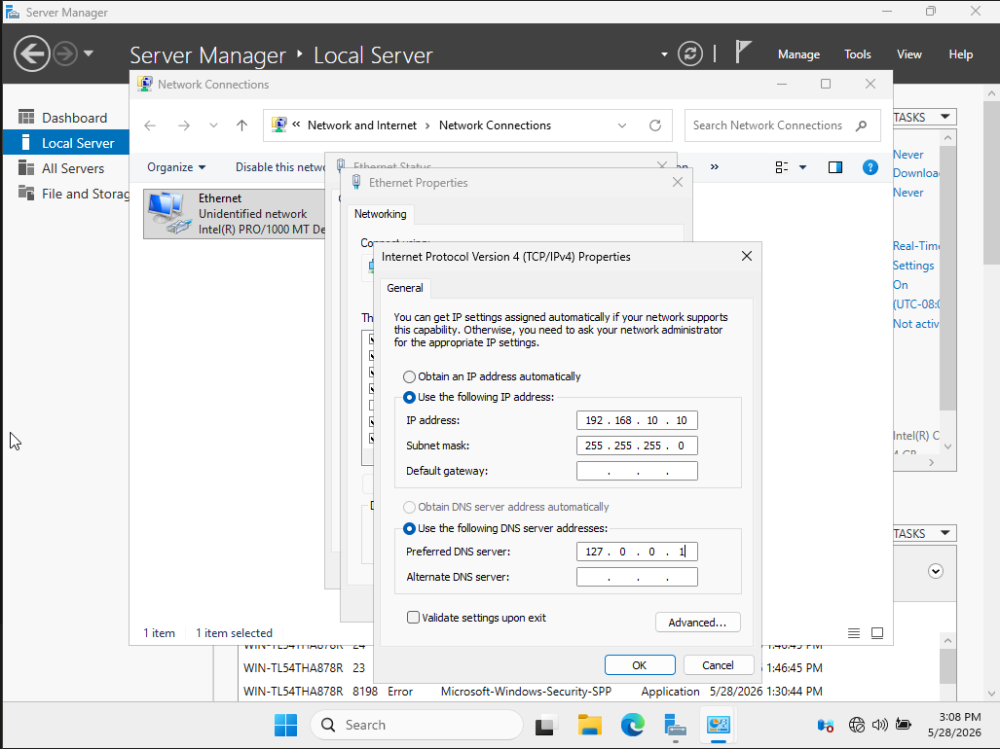
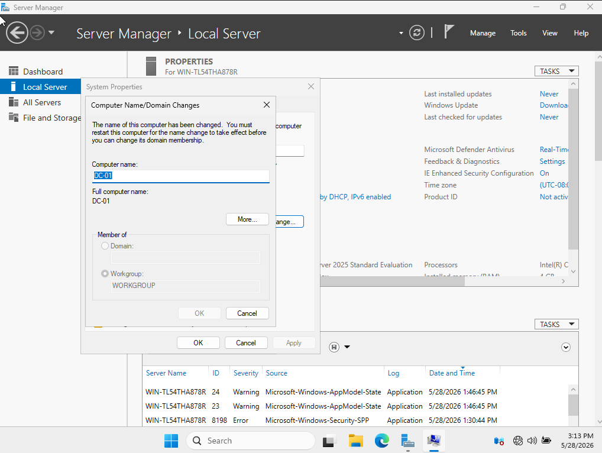

Verified with `hostname` and `ipconfig`, then took a snapshot (`pre-ADDS`)
as a rollback point.

---

## Phase 2: Active Directory Domain Services Promotion

### Role installation
Installed the **Active Directory Domain Services** and **DNS Server** roles
via Server Manager → Add Roles and Features.

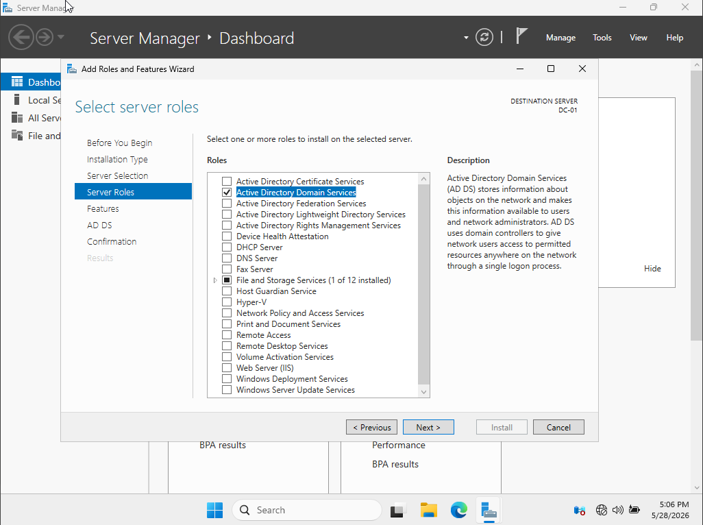
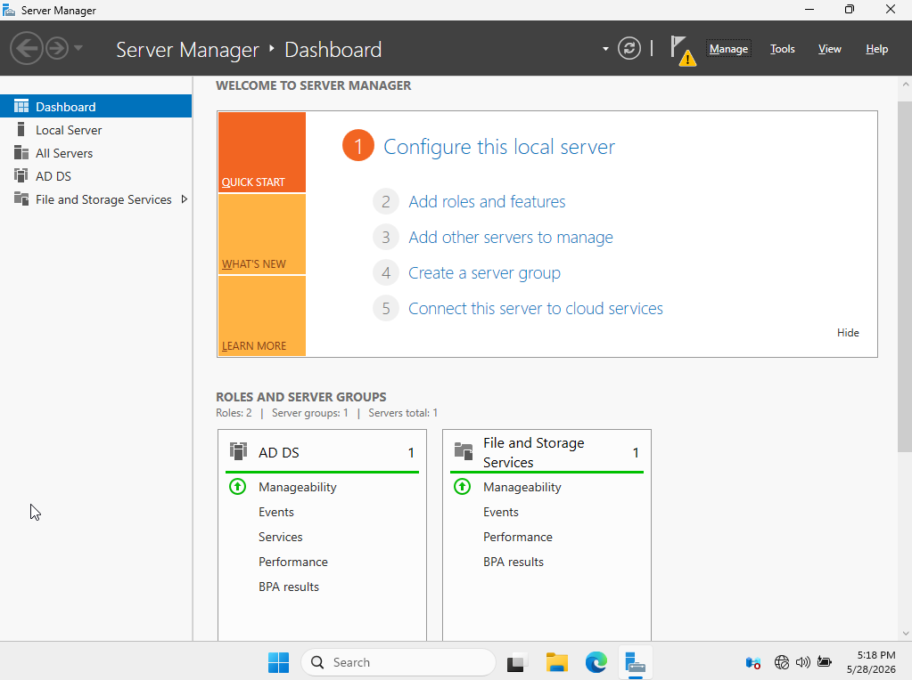

### Promotion
Promoted DC01 to a domain controller in a **new forest**.

| Setting | Value |
|---|---|
| Deployment | New forest |
| Root domain | `lab.local` |
| Functional level | Windows Server 2025 |
| DNS server | Enabled |
| DSRM password | Set (recovery use) |

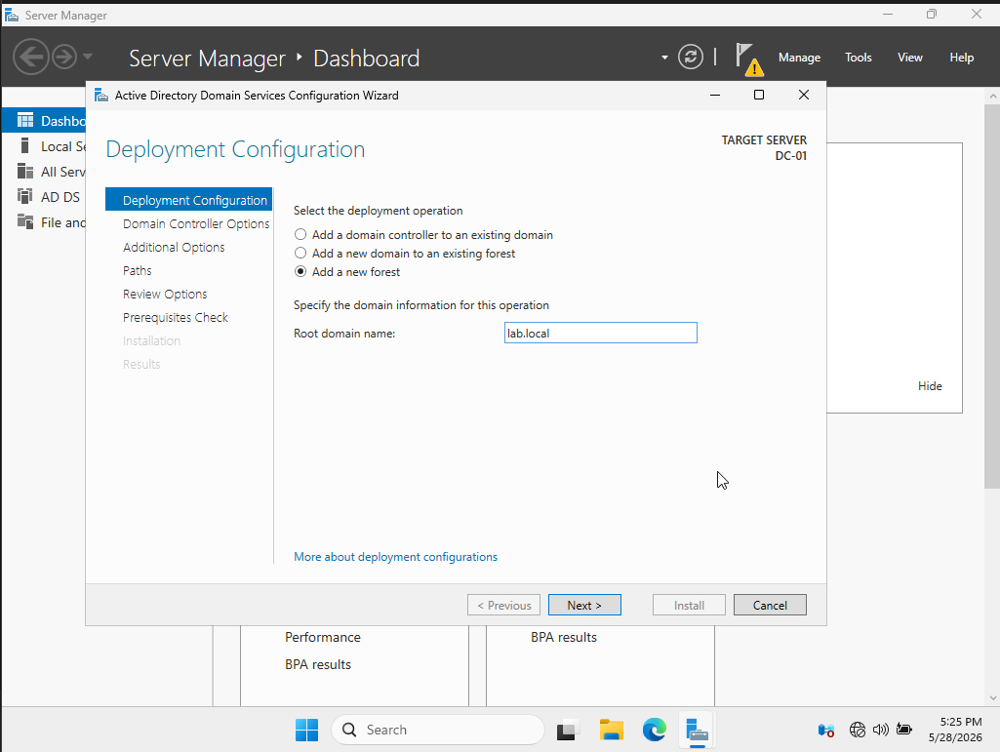
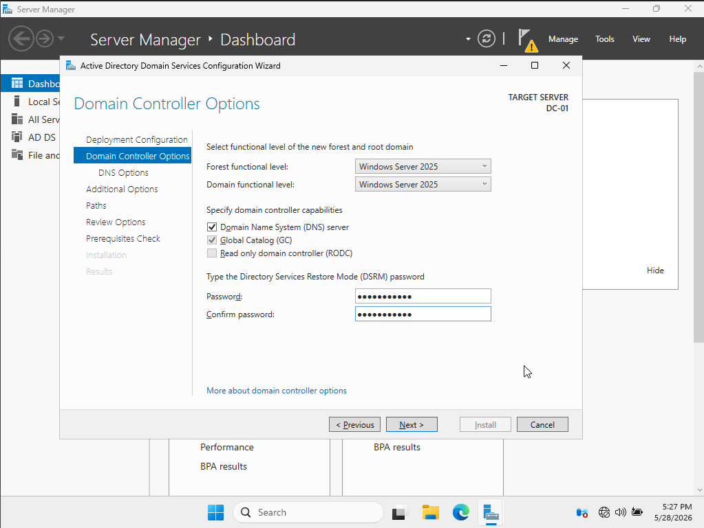
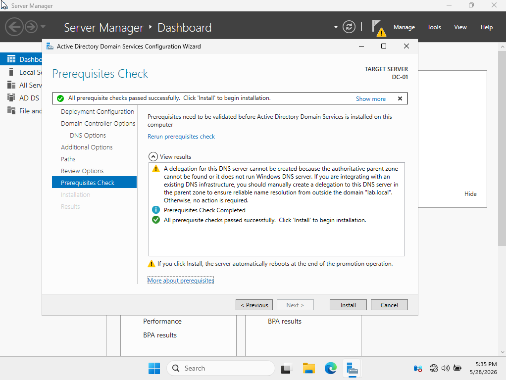

The server rebooted automatically and came back showing `LAB\Administrator`
at login confirming the domain was live.

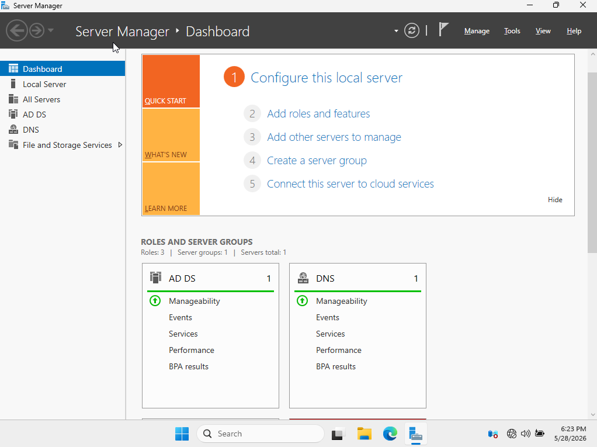

---

## Verification

Confirmed the domain controller was healthy three independent ways:

**1. DNS resolution**

nslookup lab.local -> 192.168.10.10
(A reverse lookup timeout on '::1' appeared first, which was expected since no reverse zone is configured. The forward lookup succeeded, which is the test that matters for this lab.)

**2. AD domain query**

Get-ADDomain -> DNSRoot: lab.local | NetBIOS: LAB | Mode : Windows2025Domain

**3. Domain controller diagnostics**

dcdiag -> all functional tests passed
(Connectivity, Advertising, Services, Replications, RidManager, NetLogons)

---

## Troubleshooting Note: dcdiag SystemLog & DFS-REvent Failures

Initial 'dcdiag' reported two failed tests: **SystemLog** and **DFS-REvent**.

**Diagnosis:**

-**SystemLog** flagged "unexpected shutdown events. Root cause: forced VM power-offs during early setup (mouse/display troubleshooting), which the DC logged as unclean shutdowns. Also included a transient KDC/SAM initialization error normal on freshly promoted DC.

-**DSFREvent** flagged SYSVOL replication events. Root cause: normal first-time SYSVOL initialization on a brand-new single domain controller (no replication partner exists yet).

**Resolution:** Performed a clean reboot from inside Windows and re-ran diagnostics. All functional tests passed. The flagged events were historical log entries that age out of the 24-hour scan window. Confirmed benign.

**Lesson:** Always shut down the VM from inside the OS (Start -> Power) or via ACPI Shutdown, never VirtualBox's power-off/reset, which a domain controller records as a crash.

## Phase 3: DHCP Server

Installed and configured DHCP so client VMs receive IP addresses, DNS, and domain settings automatically on boot, matching how a real network operates.

### Role Installation
Installed the DHCP role via PowerShell:

    Install-WindowsFeature -Name DHCP -IncludeManagementTools

### Authorization in Active Directory
A DHCP server must be authorized in AD before it can lease addresses. This prevents rogue DHCP servers from disrupting the domain.

    Add-DhcpServerInDC -DnsName "DC01.lab.local" -IPAdress 192.168.10.10

The command returned an "RPC server is unavailable" warning, but the line above it cofnirmed successful authorization. 'Get-DhcpServerInDC' verified DC01 was registered. The RPC Warning was a transient post-authorization check, not a failure.

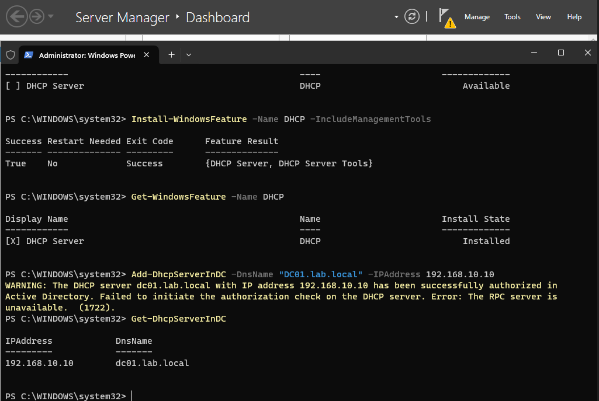

### Security Groups
Created the DHCP Administrators / Users groups the service expects, then restarted the servie:

    netsh dhcp add securitygroups
    Restart-Service dhcpserver

### Scope Configuration

| Setting | Value |
|---|---|
| Scope name | 'LAB-Clients' |
| Range | '192.168.10.100 - 192.169.10.200' |
| Subnet Mask | '255.255.255.0 |
|Lease duration | 8 days |
|State | Active |

    Add=DhcpServerv4Scope -Name "LAB-Clients" -StartRange 192.169.10.100 
    -EndRange 192.169.10.200 -SubnetMask 255.255.255.0 -State Active

### Scope Options
Configured the options clients receive alongside their IP:

| Option | Code | Value |
|---|---|---|
| DNS Server | 6 | '192.168.10.10' |
| DNS Domain Name | 15 | 'lab.local' |
| Router (gateway) | 3 | '192.168.10.10' |
| Lease Time | 51 | 8 days |

    Set-DhcpServerv4OptionValue -ScopeId 192.168.10.0 -DnsServer 192.168.10.10 -DnsDomain "lab.local" -Router 192.168.10.10

**Why Option 6 matters:** Pointing clients to DC01 for DNS is what allows them to locate the domain and complete domain join and login. Without it, clients get an address but can't find the domain.

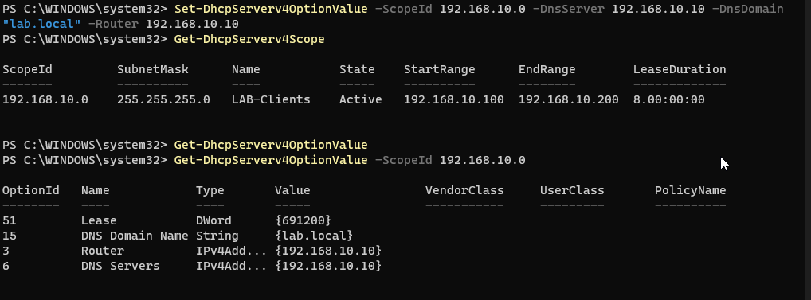

### Verification
'Get-DhcpServerv4Scope' confirmed the LAB-Clients scope was Active with the correct range; 'Get-DhcpServerv4OptionValue' confirmed all four options were set.

---

## Troubleshooting Note: Stale Server Manager Dashboard Alerts

After completing DHCP, Local Server and All Servers showed red alerts.

**Diagnosis:**
- **Events** - two Critical Kernel-Power (event ID 41) entries, indicating unclean shutdowns. Root cause: forced CM power-offs during earlier sessions. Historical, not current.
- **Services** - flagged 'InventorySvc' (Inventory and Compatibility Appraisal) as stopped. This is an Automatic (Delayed Start) telemetry service that idles when not in use. Stopped is its normal state.

**Verification:** Confirmed no genuinely-failed services by querying for auto-start services that weren't running. The query returned nothing, proving all critical services (AD DS, DNS, DHCP) were healthy.

    Get-Service | Where-Object {$_.StartType -eq 'Automatic' and $_.Status -ne 'Running'}

**Resolution:** Hid the stale Kernel-Power event alerts and started InventorySvc to clear its flag. Dashboard returned to green. Both alerts were confirmed benign before clearing.

# Phase 4: Client Deployment & Domain Join

Deployed a Windows 11 Pro client, confirmed automatic IP assignment from the domain controller's DHCP scope, and joined it to the 'lab.local' domain so it authenticates against Active Directory.

## Client VM
- **OS:** Windows 11 Pro
- **VM Specs"** 4 GB RAM, 2 vCPU, 60 GB disk
- **Network:** VirtualBox Internal Network ('LAB-NET') - same isolated network as DC01
- **Firmware:** TPM 2.0 and Secure Boot enabled for Win11 requirements

## Installation notes
- Bypassed the Windows 11 hardware check (TPM/Secure Boot/RAM) during setup via the 'LabConfig' registry keys, required to install in the VM environment.
- Bypassed the OOBE Microsoft-account requirement using 'OOBE\BYPASSNRO', then selected "I dont have internet" to create a local account, appropriate for a domain client on an isolated network with no internet access.

## DHCP verification
With DC01 running, confirmed the client received its full IP configuration automatically from the DHCP scope built in Phase 3:

| Setting | Value |
|---|---|
| IPv4 address | '192.168.10.x' (from scope range .100-.200) |
| Subnet mask | '255.255.255.0' |
| DHCP Server | '192.168.10.10' |
| DNS Server | '192.168.10.10' |

This validated Phases 1-3 end to end: the client pulled an address from the scope, with DC01 correctly assigned as its DNS server.

## Domain join
Joined CLIENT01 to 'lab.local' via System Properties -> Change. Authenticated with the domain Administrator account. After reboot, logged in as a domain user and confirmed memebrship:

    systeminfo | findstr /B "Domain" -> Domain: lab.local

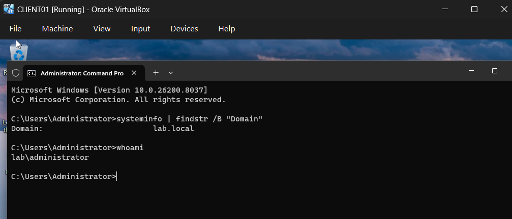

---

## Troubleshooting Note: Client could not resolve or join the domain

After deployment, the client could ping the DC by IP but could not resolve 'dc01.lab.local', and the domain join failed with "the specified domain either does not exist or could not be contacted."

**Diagnosis (worked through in layers):**
1. 'ping 192.168.10.10' succeeded but 'ping dc01.lab.local' failed -> network path was fine. The problem was DNS name resolution.
2. Client's DNS server was correctly set to '192.168.10.10', so it was asking the right server.
3. 'nslookup dc01.lab.local 192.168.10.10' returned "non-existent domain" -> DC01's DNS service was answering, but had no host record for itself.
4. On DC01: the 'lab.local' zone existed, was AD-integrated ('IsDsIntegrated: True'), and accepted secure dynamic-updates, but DC01's own A record was missing. The DC has not self-registered.
5. After fixing the A record, the domain join still failed because the required SRV service records ('_ldap._tcp.dc._msdcs.lab.local') were also missing. These are what a client uses to locate the domain controller.

**Resolution:**
- Manually created the missing A record:

    Add-DnsServerResourceRecordA -ZoneName "lab.local" -Name "dc01" -IPv4Address "192.168.10.10"

- Restarted Netlogon to force full registration of the DC's SRV records:

    Restart-Service Netlogon

- Verified the SRV record resolved:

    nslookup -type=SRV _ldap._tcp.dc._msdcs.lab.local 127.0.0.1 -> dc-01.lab.local

- Flushed the client's DNS cache ('ipconfig /flushDNS') to clear the cached negative results, then retried the join which completed successfully.

**Lesson:** A domain join depends on DNS, specifically the DC's SRV records, not just basic connectivity. A reachable IP and even a working A record aren't enough. THe client locates the domain controller through SRV records regustered by Netlogon. When a DC failes to self-register, 'ipconfig /regusterdns' plus a Netlogon restart forces it.

---

## Note: Domain Controller Availabiltiy
During the join, DC01 pwoered off unexpectedly, producing a "domain could not be contacted" error mid-handshake. The domain controller must remain running whenever clients are authenticating, as it provides DNS, DHCP, and authentication for the entire domain. Lab workflow: always boot DC01 first and keep it running before working with clients.

# Phase 5: Directory Administration: OUs, Users & Groups

Built out the Active Directory structure: an organizational unit hierarchy, user accounts created both manually and in bulk via PowerShell, demonstrating scalable provisioning.

## OU Structure
Created a parent OU 'LAB' with three child OUs, separating objects by type:

    Lab
    |- Users
    |- Groups
    |- Computers

OUs are containers used to organize directory objects and to target Group Policy (Phase 6). "Protect from accidental deletion" is left enabled on OUs forcing deletion to be a deliberate, multi-stop action, preventing a single misclick from wiping out a contrainer full of live accounts.

## Manual User Creation
Created a first user ('John Smith' / 'jsmith') through Activer Directory Users and Computers to establish the required fields, then a second ('Jane Doe' / 'jdoe') via PowerShell:

    New-ADUser -Name "Jane Doe" -SamAccountName "jdoe" '
        -UserPrincipalName "jdoe@lab.local" '
        =Path "OU-Users,OU=LAB,DC=lab,DC=local" '
        -AccountPassword (ConvertTo-SecureString "LabPassword2026!" -AsPlainText -Force) '
        -Enabled $true

**Key Concepts:**
- 'NewADUser' creates accounts **disabled by default** : a fail-safe so no half-configured account is ever live before a password is set. Must explicitly pass '-Enabled $true'.
= The '-Path' value is a **Distringuished Name (DN)**, read most-specific to least-specific: 'OU=Users,OU=LAB,DC=lab,DC=local'. 'OU' = organizational unit; 'DC' = domain component ('lab.local' splits into 'DC=lab,DC=local').
- **OU placement =! permissions.** Path only determins *where* the object lives in the tree. Access comes from **group membership**, a seperate step.

## Bulk User Creation (CSV + Powershell)
The real value of scripting: provisioning many users at once. Data lives in a CSV; logic lives in the script.

**'C:\Lab\users.csv' :**

    FirstName,LastName,SamAccountName,Department
    Robert,Black,rblack,IT
    Carol,Jones,cjones,Sales
    Devin,Frost,dfrost,Marketing

**Script:**

    Import-Csv C:\Lab\users.csv | ForEach-Object {
        New-ADUser -Name "$($_.FirstName) $($_.LastName)" `
            -SamAccountName $_.SamAccountName `
            -UserPrincipalName "$($_.SamAccountName)@lab.local" `
            -Path "OU=Users,OU=LAB,DC=lab,DC=local" `
            -AccountPassword (ConvertTo-SecureString "LabPassword2026!" -AsPlainText -Force) `
            -Enabled $true
    }

**How it works:**
- `Import-Csv` reads the file; the pipe (`|`) hands each row to
  `ForEach-Object`, which runs the code block **once per row**.
- `$_` is the current row; `$_.FirstName` pulls that row's FirstName value.
  Each loop pass, the same code operates on a different row's data.
- Per-person data (names, logon names) lives in the **CSV**; shared values
  (`-Path`, `-Enabled`, password) are set **once in the script**, separating
  data from logic avoids redundancy and gives a single source of truth.

**Why this matters:** the script is identical whether the CSV has 3 users or
300. Write the logic once, scale the data infinitely, provisioning effort
stays flat regardless of headcount.

---

## Troubleshooting Note: PowerShell Line Continuation

The bulk script initially failed with "the name provided is not a properly
formed account name" and "SamAccountName is not recognized as a cmdlet."

**Cause:** the backtick (`` ` ``) line-continuation characters were lost when
pasting the multi-line command. Without them, PowerShell read each line as a
separate command instead of one continuous `New-ADUser` call.

**Resolution:** ran the command as a single line (no backticks needed), which
executed cleanly and created all three users.

**Lesson:** the backtick tells PowerShell a command continues on the next
line. When it goes missing, multi-line commands break apart. Writing a command
on one line sidesteps the issue entirely.